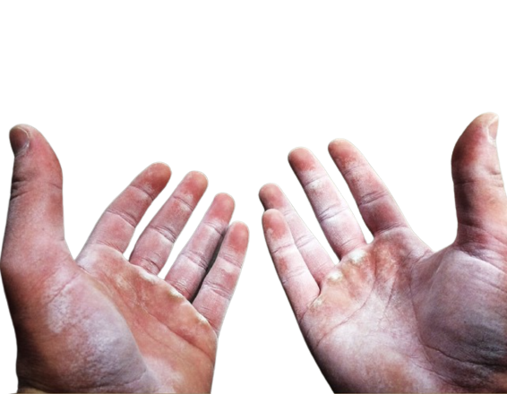

# Personal Portfolio

This portfolio was initially completed as part of the onboarding for the VetsWhoCode March 2022 Romeo Golf cohort.

Here we each built our own portfolio utilizing HTML, CSS, and Javascript. Over time we made our portfolios both more accessible and better performing.

### Things left to do:
- [ ] Finish mobile layout
- [ ] Complete additional pages
- [ ] Add reCaptcha to form
- [ ] Add accessibility components
- [ ] Update color scheme accents
- [ ] Fine tune transitions
- [ ] Run performance tests

>Every day, we have a choice to make ourselves better or to fall back into complacency. Use this day to create something out of nothing, and level yourself up.

  

