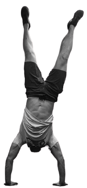

# Personal Portfolio

<header class="header" style="  width: 100%;
  display: flex;
  justify-content: space-between;
  align-items: center;
  padding-left: 0.5rem;
  padding-right: 0.5rem;
  padding-top: 0.5rem;">
      

        <a href="" class="logo"><?xml version="1.0" encoding="UTF-8"?><svg id="a" xmlns="http://www.w3.org/2000/svg" viewBox="0 0 279.76 322.42" style="height: 5rem;
  width: 5rem;"><text class="b" transform="translate(72.26 187.77)"style="fill:white; font-family:NanumMyeongjo, Nanum Myeongjo;font-size:70px;"><tspan x="0" y="0">포터</tspan></text><polygon class="c" style="fill:transparent;stroke:white;stroke-miterlimit:10;stroke-width:7px;"points="3.51 83.08 139.35 4.04 275.73 82.17 276.26 239.33 140.41 318.37 4.04 240.25 3.51 83.08"/></svg></a>
      

      <nav>
        <ul class="navLinks" style="display: flex;
  flex-direction: row;">
          <li style="list-style: none;
  display: flex;
  padding: 0.5rem;"><a style="text-decoration: none;
  color: white;
  padding: 0.5rem;" href="about.html" onMouseOver="this.style.color='blue'">About</a></li>
          <li style="list-style: none;
  display: flex;
  padding: 0.5rem;"><a style="text-decoration: none;
  color: white;
  padding: 0.5rem;"href="contact.html">Connect</a></li>
        </ul>
      </nav>
    </header>
<section class="hero" style="  display: inline-flex;
  flex-direction: row;
  width: 100%;
  height: 510px;
  padding: 2rem;">
        

          
welcome!

          <h1 class="intro" style="margin-top: 3rem;
  margin-bottom: 2rem;">
            Thanks for joining, 
            I'm Cameron Porter
          </h1>
          

            I'm a <strong>veteran turned software engineer.</strong>
          

          

            <a style="text-decoration: none;color:yellow;" href="#" class="hangul">한국어</a>
            <a style="text-decoration: none;  margin-left: 3rem;
  padding: 0.3rem;
  width: 110px;
  border-radius: 15px;
  color: var(--color2);
  background-color: var(--accent);
  border: none;" href="#aboutMe" class="aboutButton">About me ↓</a>
          

        

        

          
        

      </section>
Demo as of 4/4/2022:

 

This portfolio was initially completed as part of the onboarding for the VetsWhoCode March 2022 Romeo Golf cohort.

Here we each built our own portfolio utilizing HTML, CSS, and Javascript. Over time we made our portfolios both more accessible and better performing.
